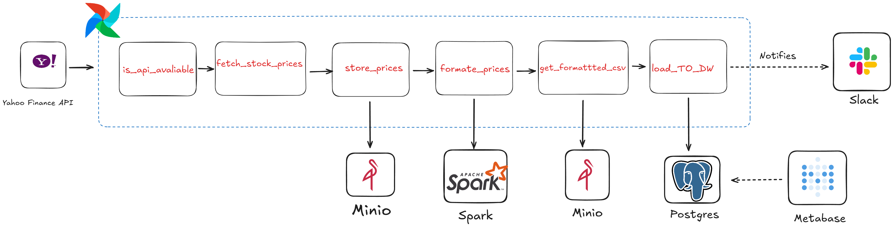

This project demonstrates a modern, end-to-end ETL/ELT data pipeline built with Apache Airflow. It automates the process of fetching daily stock market data, processing it at scale with Apache Spark, storing it in a MinIO data lake, and loading it into a PostgreSQL data warehouse for BI analysis with Metabase.
The entire environment is containerized with Docker and managed using the Astro CLI for easy development and deployment.

## **Key Features**
   # Automated ETL/ELT: Fully orchestrated workflows managed by Airflow.
   # Scalable Data Processing: Leverages Apache Spark for large-scale, distributed data transformations.
   # Data Lake Architecture: Uses MinIO to store raw and processed data, decoupling storage from compute.
   # Containerized Environment: All services (Airflow, Spark, PostgreSQL, MinIO) run in Docker for consistency and portability.
   # BI & Visualization: Connects to Metabase for creating insightful dashboards.
## **Architecture**
The diagram below illustrates the flow of data from the source API through the various components of the pipeline to the final dashboard.

## **Tech Stack**
Component	       Technology	Role
Workflow Engine	 Apache Airflow (Astro CLI)	Orchestrates, schedules, and monitors the entire data pipeline.
Data Lake	       MinIO	Stores raw JSON data from the API and formatted Parquet/CSV data from Spark.
Processing         Engine	Apache Spark	Transforms and cleans raw data in a distributed and scalable manner.
Data Warehouse	    PostgreSQL	Stores the final, structured data ready for analytics.
BI Tool	          Metabase	Visualizes the data from PostgreSQL through interactive dashboards.
Programming	       Python	Used for DAG definition, API interaction, and Spark transformation logic.
Containerization   Docker / Docker Compose	Encapsulates all services to ensure a consistent and isolated environment.

## **Pipeline Workflow**
The DAG stock_market executes the following sequence of tasks:
   Extract: A task calls an external stock market API to fetch the latest price data for a given stock symbol.
   Load (Raw): The raw JSON response from the API is saved directly into a MinIO bucket, serving as our immutable data lake source.
   Transform: A Spark job is triggered. It reads the raw JSON file from MinIO, performs cleaning and formatting (e.g., flattens the structure, converts timestamps), and prepares the data for analysis.
   Load (Formatted): The transformed data is written back to a different location in MinIO, typically in a more efficient format like Parquet or CSV.
   Load to Warehouse: A final task loads the clean, formatted data from MinIO into a structured table in the PostgreSQL data warehouse.
   Visualize: Metabase is connected to the PostgreSQL database, allowing for the creation of dashboards that query the newly loaded data.

## **Getting Started**
Follow these instructions to set up and run the project on your local machine.
 # Prerequisites
 Docker Desktop: Ensure it is installed and running with at least 8GB of memory allocated.
 Astro CLI: Install the Astro CLI by following the official documentation.
 # Installation & Setup
 Clone the Repository
code
Bash
git clone https://github.com/abdelrhmanmousa/Airflow-Stock-Pipeline.git
cd Airflow-Stock-Pipeline
Start the Astro Environment
This command will build and start all the services defined in docker-compose.override.yml, including Airflow, Spark, MinIO, and PostgreSQL.
code
Bash
astro dev start
Note: The first time you run this, it may take several minutes to download all the Docker images.
Verify Services
Once the environment is up, you can access the different UIs:
Airflow UI:
URL: http://localhost:8080
Login: admin / admin
MinIO Console (Data Lake):
URL: http://localhost:9001
Login: minio / minio123
Metabase UI:
URL: http://localhost:3000
Setup: On your first visit, connect it to the PostgreSQL database using the credentials below.
PostgreSQL Database:
Host: postgres
Port: 5432
User: postgres
Password: postgres
Database: postgres
How to Run the DAG
Enable the DAG in the Airflow UI
Navigate to the Airflow UI at http://localhost:8080.
Find the stock_market DAG and toggle the switch to enable it.
Click the "Play" button to trigger a manual run.
Trigger a Run via the CLI (for testing)
You can also trigger a DAG run for a specific logical date from your terminal.
code
Bash
# Example: Run the DAG for the logical date of September 1st, 2023
astro dev run dags test stock_market 2023-09-01
Folder Structure
code
Code
.
├── Architecture/
│   └── Airflow_Arch_Project.png
├── dags/                  # Airflow DAGs (e.g., stock_market.py)
├── include/               # Helper scripts and Spark transformation jobs
├── plugins/               # Custom Airflow plugins (if any)
├── .astro/
├── docker-compose.override.yml # Defines services like Spark, Minio, etc.
├── Dockerfile             # Custom Dockerfile for the Astro project
├── packages.txt           # OS-level packages
├── requirements.txt       # Python dependencies
└── README.md
Future Improvements
Integrate Kafka: Introduce a real-time streaming layer with Kafka for lower latency.
Expand Data Sources: Add connectors for other financial data, such as cryptocurrencies or forex markets.
Implement dbt: Add dbt for more robust, version-controlled transformations within the data warehouse.
Add Data Quality Checks: Integrate a library like Great Expectations to validate data at each stage of the pipeline.
